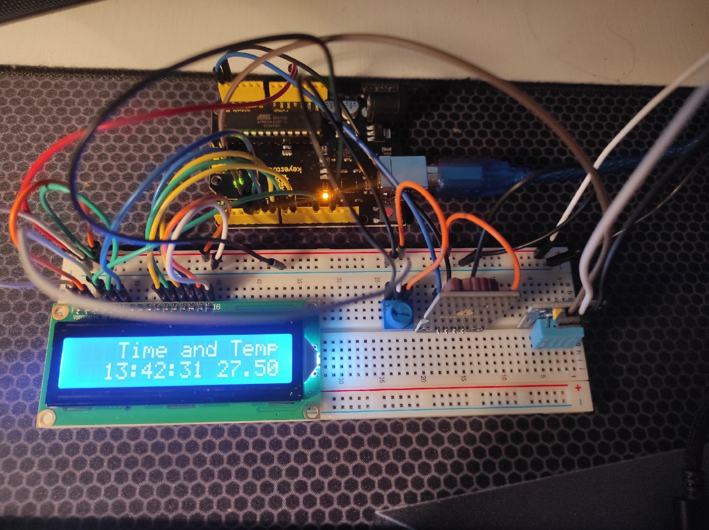

# Arduino-Time-and-Temperature

Simple project for time and temperature output

Project demonstration:

<h3>Components:</h3>

-Arduino Uno

-1602 LCD Display

-DS3231 Clock Module

-DHT11 Temperature and Humidity Sensor

-10KΩ Potentiometr
